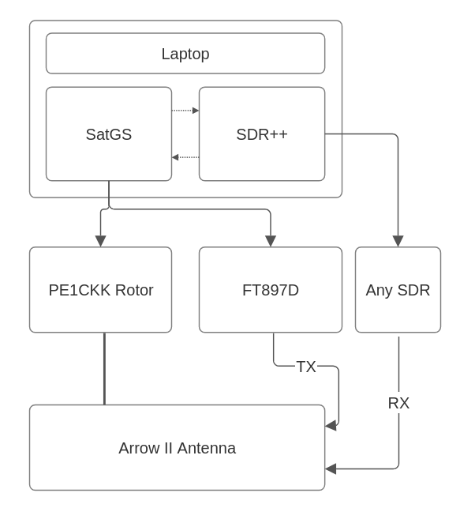

# Example Setup

This page will show you my (DB8LE) personal portable satellite setup for working LEO satellites, as an example of how satgs can be used.

Here is a block diagram to visualize how the individual components are connected to eachother:


And a picture of the setup in real life:


The transceiver and rotor can be replaced with any part that meets your requirements, or even be skipped. The SDR is only limited by having to be supported by SDR++, or another SDR software that allows for rigctl control.

## Configuration

The configuration is very straight forward.
This is the configuration for the rotor:

```json
rotors/pe1ckk.json
{
    "usb_port": "/dev/ttyUSB0",
    "rotctl_ID": 601,
    "min_az": 1,
    "max_az": 359,
    "min_el": 2,
    "max_el": 90,
    "control_type": 1,
    "home_on_end": true
}
```

And the FT897D plus SDR:

```json
radios/ft897d_sdr.json
{
    "sdr": {
        "rigctl_port": 4532
    },
    "tx": {
        "usb_port": "/dev/ttyUSB0",
        "rigctl_ID": 1043,
        "serial_speed": 38400,
        "offset": 0
    }
}
```

## Preparing for a pass

All that is needed to get this setup ready for a satellite pass is:

1. Connect everything
2. Start SDR++ rigctl listener and ensure correct settings
3. Start satgs using `$ satgs track <some satelltie> --radio ft897d_sdr --rotor pe1ckk`

That's it!
